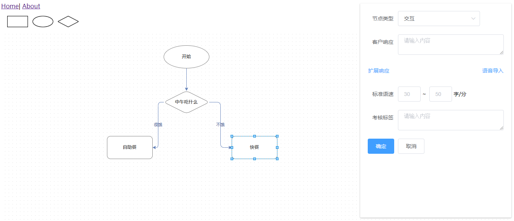

# vue-mxgraph-samples
> 在 vue2 中使用 mxgraph 的一些用例 / used mxgraph in vue2

## 核心文件
用于封装 mxgraph 的核心文件 [vue-mxgraph/src/assets/mxgraph/4.0.0/mxgraph.js](vue-mxgraph/src/assets/mxgraph/4.0.0/mxgraph.js)

```
let mxgraphFactory = require('mxgraph')

const factory = new mxgraphFactory({
  mxImageBasePath: 'assets/mxgraph/4.0.0/images',
  mxBasePath: 'assets/mxgraph/4.0.0'
})

module.exports = factory
```
在 vue 中引用的方法如下
```
import {
  mxClient,
  mxUtils,
  mxEvent,
  mxGraph,
  mxConstants,
  mxRubberband
} from '@/assets/mxgraph/4.0.0/mxgraph'
```
样例：

[vue-mxgraph/src/views/Graph.js](vue-mxgraph/src/views/Graph.js)

参考：

[jgraph/mxgraph/issues/175/npm install](https://github.com/jgraph/mxgraph/issues/175)

[Editor doesn't created when mxGraph is used as npm module](https://github.com/jgraph/mxgraph/issues/49)

## Demo
